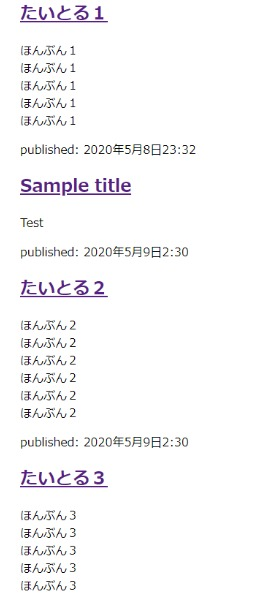

# my-first-blog
****
This website enbles you to share your life as a diary and create and manage your online identity.


# Description
This is a repository that contains with the source code for the DjangoGirls Tutorials,
This tutorial, which is run by the organization DjangoGirls, aims to cover the fundamentals of using HTML, CSS, Python, and Django. 
<br>
You should be able to create your own working **blog** with the source code.


# Demo
On the top page, click + on the right top corner to make a new blog post.

<br>
<br>
Then fill out the title, text, save, then voila! Now you have your first blog post appears.


# Requirement
****
- Windows 10 Home21H2
- HTML
- CSS
- Python 3.10.8
- Django~=3.2.10
- Visual Studio Code
- Virtual Environments (venv)
- Pythonanywhere
- GitHub


# Usage
****
### Here is a list of the procedures for setting up a blog.
<br>
<br>

1. Set up a virtual environment and Django
  <br>- Create folder "djangogirls" 
  <br>〈command-line〉
    ```
    > mkdir djangogirls
    > cd djangogirls
    ```
    <br>- Create a virtual environment
 <br>〈command-line〉
    ```
    > python -m venv myvenv
    > Set-ExecutionPolicy -ExecutionPolicy　RemoteSigned -Scope Process
    > myvenv/Scripts/activate
    ```
    <br>- Install django with pip
 <br>〈command-line〉
    ```
    (myvenv)> python -m pip install --upgrade pip
    ```
2. Create a first Django project
<br>〈command-line〉
    ```
    > django-admin.exe startproject mysite .
    ```
3. Make some changes on setting.py
    1. Set time zone
      <br>〈mysite/settings.py〉
        ```
        TIME_ZONE = 'Asia/Tokyo'
        ```
    2. Set language
      <br>〈mysite/settings.py〉
        ```
        LANGUAGE_CODE = 'ja'
        ```
    3. Set static file location
      <br>〈mysite/settings.py〉
        ```
        STATIC_URL = '/static/'
        STATIC_ROOT = os.path.join(BASE_DIR, 'static')
        ```
    4. Set host address
      <br>〈mysite/settings.py〉
        ```
        ALLOWED_HOSTS = ['127.0.0.1', '.pythonanywhere.com']
        ```
    5. Database settings
    <br>〈mysite/settings.py〉
        ```
        DATABASES = {
            'default': {
                'ENGINE': 'django.db.backends.sqlite3',
                'NAME': os.path.join(BASE_DIR, 'db.sqlite3'),
            }
        }
        ```
4. Add app
  <br>- Make a new app called "blog" for mysite.
  <br>〈command-line〉
    ```
    (myvenv)> python manage.py startapp blog
    ```
    <br>- Inform the project that the app has been added.
   <br>〈command-line〉
    ```
    mysite/setting.py
    INSTALLED_APPS = [
        'django.contrib.admin',
        'django.contrib.auth',
        'django.contrib.contenttypes',
        'django.contrib.sessions',
        'django.contrib.messages',
        'django.contrib.staticfiles'＞,
        'blog.apps.BlogConfig',  #Added line
    ]
    ```
  5. Include a model in your app.
  <br>- Incorporate the Post model into your blog app.
  <br>〈blog/models.py〉
      ```
        from django.conf import settings
        from django.db import models
        from django.utils import timezone


        class Post(models.Model):
            author = models.ForeignKey(settings.AUTH_USER_MODEL, on_delete=models.CASCADE)
            title = models.CharField(max_length=200)
            text = models.TextField()
            created_date = models.DateTimeField(default=timezone.now)
            published_date = models.DateTimeField(blank=True, null=True)

            def publish(self):
                self.published_date = timezone.now()
                self.save()

            def __str__(self):
                return self.title
      ```
      <br>- Let the database know that you have added the model. Only when building a model is this procedure required.
  <br>〈command-line〉
      ```
      (myvenv)> python manage.py makemigrations blog
      [Migrate] the model (https://wa3.i-3-i.info/word17035.html). Do this if the model configuration changes in the future.
      terminal
      (myvenv)> python manage.py migrate blog
      ```
  6. Register the administrator
  <br>- Django has a function known as Django Admin. For each project, a management screen is automatically created, which can only be viewed if you log in with administrator rights.
  <br>- First, Create a user with administrator rights.
  <br>〈command-line〉
      ```
      (myvenv)> python manage.py createsuperuser
      ```
     <br>- To register the information, follow the instructions.
     <br>〈command-line〉
     ```
      Username: 
      Email address: @example.com
      Password:
      Password (again):
      Superuser created successfully.
      ```
      <br>-  Following that, you can access the management screen as a registered user by logging in.
      <br>

  7. Display the model on the admin screen.
  <br>- Make the newly created Post model available on the management screen.
  <br>〈blog/admin.py〉
      ```
      from django.contrib import admin
      from .models import Post

      admin.site.register(Post)
      ```
  8. Launch the server.
  <br>〈command-line〉
      ```
      (myvenv)> python manage.py runserver
      ```
      <br>- Open http: // localhost: 8000 in your browser and you should see the django sample page.
      
      ```
  9. Deploy the project
    <br>〈command-line〉
  
      ```
      $ git init
      Initialized empty Git repository in ~/djangogirls/.git/
      $ git config --global user.name "Your Name"
      $ git config --global user.email you@example.com
      ```
      <br>- Register in.gitignore any files or directories that git does not reflect.
      <br>〈.gitignore〉
      ```
      *.pyc
      *~
      /.vscode
      __pycache__
      myvenv
      db.sqlite3
      /static
      .DS_Store
      ```
      <br>〈command-line〉
      ```
      $ git status
        On branch master

        No commits yet

        Untracked files:
          (use "git add <file>..." to include in what will be committed)

                .gitignore
                blog/
                manage.py
                mysite/
                requirements.txt

        nothing added to commit but untracked files present (use "git add" to track)
      ```
      <br>- Push it to github since it appears to be safely reflected there.
      <br>〈command-line〉
      ```
      $ git add --all .
      $ git commit -m "My Django Girls app, first commit"
      [...]
      13 files changed, 200 insertions(+)
      create mode 100644 .gitignore
      [...]
      create mode 100644 mysite/wsgi.py
      ```
10. Deploy to PythonAnywhere
      <br>- Sign up for a Python AnyWhere account at https://www.pythonanywhere.com. <br>Create an API Token by selecting Account from the menu in the upper right after creating an account.
      <br>- Open the New console located in the Dashboard's lower left corner.
      
      <br>
      <br>
      <br>〈pythonAnywhere_command-line〉
      ```
      pip3.6 install --user pythonanywhere
      pa_autoconfigure_django.py --python=3.6 https://github.com/github username/my-first-blog.git
      ```
      <br>- Let's use the ls command to verify the files that were synchronized.
      <br>〈pythonAnywhere_command-line〉
      ```
      $ ls
      blog  db.sqlite3  manage.py  proj1  static
      $ ls blog/
      __init__.py  __pycache__  admin.py  apps.py  migrations  models.py  tests.py  views.py
      ```
      <br>- The django superuser generated previously is not yet registered because the helper tool is creating a new virtual environment using github's code; thus, register it using the command below.
      <br>〈pythonAnywhere_command-line〉
      ```
      python manage.py createsuperuser
      ```
      <br>- The identical thing you created locally is now being published online. There is a link to the website that you may open if you navigate to the Web Apps page from the PythonAnywhere Dashboard.
      <br>- You can notice that there isn't a Post when you first access the administration screen. This is due to the database being written in.gitignore, which prevents it from being synchronized to github. To avoid accidentally overwriting the production DB, the.gitignore setting is crucial.
    <br>
11. Make a view
      <br>- Write a link to view
      <br>It says something along these lines when I open urls.py, and when I navigate to http: / localhost / admin /, it is configured to refer to admin.site.urls. I'll write this because I haven't yet specified a link to the blog view.
      <br>〈proj1/urls.py〉
      ```
      from django.contrib import admin
      from django.urls import path, include

      urlpatterns = [
          path('admin/', admin.site.urls),
          path('', include('blog.urls')),
      ]
      ```
      <br>- When you access http://localhost/, instruct blog.urls.py to refer to the view post list from blog / views.py.
      <br>〈proj1/urls.py〉
      ```
      from django.urls import path
      from . import views

      urlpatterns = [
          path('', views.post_list, name='post_list'),
      ]
      ```
      <br>- Create the post list function set for views.py that was mentioned earlier. The blog / post list.html contents are returned in their original form in this case.
      <br>〈blog/views.py〉
      ```
      from django.shortcuts import render

      def post_list(request):
          return render(request, 'blog/post_list.html', {})
      ```
      <br>- Now, the link will be connected to proj1 / urls.py proj1 / blog / urls.py proj1 / blog / views.py proj1 / blog / post list.html when you go to http: / localhost /.
      <br>
      <br>Now that I don't have proj1 / blog / post list.html yet, I get an error page when I open the page with python manage.py runserver.and the page doesn't appear, you've made a mistake in something you've typed thus far, so review it.
      
      <br>- Make a view template
      <br>The page is ultimately displayed without any errors following the creation of proj1 / blog / templates / blog / post list.html and another check with python manage.py runserver. However, the page will be blank because nothing has been written thus far.
      
      <br>- Let's make a blog-like page.
      <br>〈proj1/blog/templates/blog/post_list.html〉
      ```
      <html>
      <head>
          <title>Django Girls blog</title>
      </head>
      <body>
          <div>
              <h1><a href="/">Django Girls Blog</a></h1>
          </div>

          <div>
              <p>published: 14.06.2014, 12:14</p>
              <h2><a href="">My first post</a></h2>
              <p>Aenean eu leo quam.Hello! Thank you!</p>
          </div>

          <div>
              <p>release date: 2014/06/14, 12:14</p>
              <h2><a href="">Second post</a></h2>
              <p>Hello! Thank you!</p>
          </div>
      </body>
      </html>
      ```


      
      
          <br>
12. Deploy
    <br>- Let's upload the currently available content to PythonAnywhere.
    <br>〈command-line〉
    ```
    git add --all
    git commit -m "changed the html for the site"
    git push
    ```
    <br>- Pull it by opening the PythonAnywhere command line.
    <br>〈pythonAnywhere_command-line〉
    ```
    git pull
    ```
    <br>- The same material should appear if you access a website from the PythonAnywhere Dashboard, reload it, and then open the page.
    <br>
13. Use of the query set
    <br>- Just like django does, you may read and write to the database using queryset. This enables you to create a description in view.py that behaves as anticipated when the object is moved.
    <br>- Open the queryset in django shell.
    <br>〈command-line〉
    ```
    python manage.py shell
    ```
    <br>-Let's import the Post class and use Post.objects.all to display every post's data ().
    <br>〈command-line〉
    ```
    >>> from blog.models import Post
    >>> Post.objects.all()
    <QuerySet [<Post:Taitoru 1>, <Post:Taitoru 2>, <Post:Taitoru 3>]>
    ```
    <br>- Then add the a Post.
    <br>〈command-line〉
    ```
    >>> from django.contrib.auth.models import User
    >>> me = User.objects.get(username='User name')
    >>> Post.objects.create(author=me, title='Sample title', text='Test')
    >>> Post.objects.all()
    <QuerySet [<Post:Taitoru 1>, <Post:Taitoru 2>, <Post:Taitoru 3>, <Post: Sample title>]>
    ```

  14. Establish a dynamic view template.
  <br>- To display the Post's database-stored contents, we will create a view template. I created a script to display the published Post data in the template just as I had done in the query set before.
  <br>- The blog / post list.html file I previously built was static HTML; however, I will rewrite it to show the value pulled from the database.
  <br>- The Python script is run in the range delimited by %%, and the value of the passed object is entered in the range delimited by, resulting in the orderly display of the post.
  <br>〈blog/templates/blog/post_list.html〉
   ```
   <html>
      <head>
          <title>Django Girls blog</title>
      </head>
      <body>
          <div>
              <h1><a href="/">Django Girls Blog</a></h1>
          </div>

          
              <div>
                  <p>published: {{ post.published_date }}</p>
                  <h2><a href="">{{ post.title }}</a></h2>
                  <p>{{ post.text|linebreaksbr }}</p>
              </div>
          
      </body>
  </html>
  
   ```
   <br>- Check the display with python manage.py runserver to make sure the Post content you put on the admin page is now visible.
   
  
  15. Arrange with CSS with Bootstrap 
    <br>- To use Bootstrap, add a link to it in the post list.html head first.
    <br>〈blog/templates/blog/post_list.html〉
      ```
      <link rel="stylesheet" href="//maxcdn.bootstrapcdn.com/bootstrap/3.2.0/css/bootstrap.min.css">
      <link rel="stylesheet" href="//maxcdn.bootstrapcdn.com/bootstrap/3.2.0/css/bootstrap-theme.min.css">
      ```
      
      <br>- Create a CSS file
      <br>Create a CSS directory in the static directory and place the blog.css file there because Django recognizes the folder named static as a static file.
      ```
      proj1
        └─── blog
            └─── static
                  └─── css
                      └─── blog.css
      ```
16. Template extension
    <br>- Common elements of the view template can be reused.
    <br>- Let's construct post list.html and divide it into two views as an example. Create the base.html file, which defines the basic design, and post list.html, which displays the post list.
    ```
    blog
      └───templates
          └───blog
                  base.html
                  post_list.html
    ```
    <br>- Add the text from "% block content%" to "% endblock%" of post list.html.
    <br>〈blog/templates/blog/base.html〉
    ```
    
    <html>
        <head>
            <title>Django Girls blog</title>
            <link rel="stylesheet" href="//maxcdn.bootstrapcdn.com/bootstrap/3.2.0/css/bootstrap.min.css">
            <link rel="stylesheet" href="//maxcdn.bootstrapcdn.com/bootstrap/3.2.0/css/bootstrap-theme.min.css">
            <link href="//fonts.googleapis.com/css?family=Lobster&subset=latin,latin-ext" rel="stylesheet" type="text/css">
            <link rel="stylesheet" href="">
        </head>
        <body>
            <div class="page-header">
                <h1><a href="/">Django Girls Blog</a></h1>
            </div>
            <div class="content container">
                <div class="row">
                    <div class="col-md-8">
                    
                    
                    </div>
                </div>
            </div>a
        </body>
    </html>
    ```
    <br>- To extend base.html, write % extends'blog / base.html% in the first line of the post list.html side.
    <br>〈blog/templates/blog/post_list.html〉
    ```
    

    
        
            <div class="post">
                <div class="date">
                    {{ post.published_date }}
                </div>
                <h2><a href="">{{ post.title }}</a></h2>
                <p>{{ post.text|linebreaksbr }}</p>
            </div>
        
    
    ```
17. Application extension<br>(Add a page to display each blog post)
  <br>- Create a link to the template
  <br>〈proj1/blog/urls.py〉
  ``` 
  from django.urls import path
  from . import views

  urlpatterns = [
      path('', views.post_list, name='post_list'),
      path('post/<int:pk>/', views.post_detail, name='post_detail'),
  ]
  ```
  <br>- Add the post_detail method to views.py in the blog. If there isn't a comparable article in the Post object, I may return 404 by using the get_object _or_404() function. The second argument of the render method specifies that the view template will be "blog / post detail.html."
  <br>〈blog/views.py〉
  ```
      from django.shortcuts import render, get_object_or_404

      def post_detail(request, pk):
          post = get_object_or_404(Post, pk=pk)
          return render(request, 'blog/post_detail.html', {'post': post})
  ```
  <br>- For the article's appearance, include a view template. I can write it quickly because I'm using base.html.
  <br>〈blog/templates/blog/post_detail.html〉
  ```
  

  
      <div class="post">
          
              <div class="date">
                  {{ post.published_date }}
              </div>
          
          <h2>{{ post.title }}</h2>
          <p>{{ post.text|linebreaksbr }}</p>
      </div>
  
  ```
  <br>- There is now a page where articles can be seen.
   

18. Deploy
  <br>〈command-line〉
  ```
  git status
  git add --all .
  git status
  git commit -m "Added view and template for detailed blog post as well as CSS for the site."
  git push
  ```
  <br>〈pythonAnywhere_command-line〉
  ```
  cd ~/Domain name.pythonanywhere.com
  git pull
  ```
  <br>- Because static files are stored in a different location on PythonAnywhere, it does not reflect CSS. It will be automatically placed if you utilize the tool.
  <br>〈pythonAnywhere_command-line〉
  ```
  workon username.pythonanywhere.com
  python manage.py collectstatic
  ```

19. Make a post form
  <br>- The blog post was entered in the current operation using the management screen found at http: / localhost/admin/, but you can develop a form to make entering it a little simpler.
  <br>- Make a post form
  ```
  blog
     └── forms.py
  ```
  <br>- To create a form, inherit the ModelForm class and only add one section. This form asks for the title and text to be entered.
  <br>〈blog/forms.py〉
  ```
  from django import forms
  from .models import Post

  class PostForm(forms.ModelForm):
      class Meta:
          model = Post
          fields = ('title', 'text',)
  ```
  <br>- In base.html, include a link to the post form.
To add a link to the posting form at the top of base.html, add the following line. If class = "glyphicon glyphicon-plus" is specified, the Bootstrap function will be used to render +.
<br>〈blog/templates/blog/base.html〉
```
<a href="" class="top-menu"><span class="glyphicon glyphicon-plus"></span></a>
```
<br>〈blog/templates/blog/base.html〉
```

<html>
    <head>
        <title>Django Girls blog</title>
        <link rel="stylesheet" href="//maxcdn.bootstrapcdn.com/bootstrap/3.2.0/css/bootstrap.min.css">
        <link rel="stylesheet" href="//maxcdn.bootstrapcdn.com/bootstrap/3.2.0/css/bootstrap-theme.min.css">
        <link href='//fonts.googleapis.com/css?family=Lobster&subset=latin,latin-ext' rel='stylesheet' type='text/css'>
        <link rel="stylesheet" href="">
    </head>
    <body>
        <div class="page-header">
            <a href="" class="top-menu"><span class="glyphicon glyphicon-plus"></span></a>
            <h1><a href="/">Django Girls Blog</a></h1>
        </div>
        <div class="content container">
            <div class="row">
                <div class="col-md-8">
                    
                    
                </div>
            </div>
        </div>
    </body>
</html>
```
  <br>- Added to urls.py
  <br>〈blog/urls.py〉
  ```
  path('post/new/', views.post_new, name='post_new'),
  ```
  <br>- And below is the final look on urls.py
  <br>〈blog/urls.py〉
  ```
  from django.urls import path 
  from . import views

  urlpatterns = [
      path('', views.post_list, name='post_list'),
      path('post/<int:pk>/', views.post_detail, name='post_detail'),
      path('post/new/', views.post_new, name='post_new'),
  ]
  ```

  <br> Add the function that views.py calls to urls.py
  <br>〈blog/views.py〉
  ```
  from django.shortcuts import redirect

  def post_new(request):
      if request.method == "POST":
          form = PostForm(request.POST)
          if form.is_valid():
              post = form.save(commit=False)
              post.author = request.user
              post.published_date = timezone.now()
              post.save()
              return redirect('post_detail', pk=post.pk)
      else:
          form = PostForm()
      return render(request, 'blog/post_edit.html', {'form': form})
  ```
  <br>- The new post page will appear as seen below if you type python manage.py runserver and open http: / localhost: 8000/post/new/ in your browser.
  
20. Create an edit form for posted posts
  <br>- Place an edit button
  <br>〈blog/templates/blog/post_detail.html〉
  ```
  <a class="btn btn-default" href=""><span class="glyphicon glyphicon-pencil"></span></a>
  ```
   <br>- And below is the final look on post_detail.html
  <br>〈blog/templates/blog/post_detail.html

  ```  



    <div class="post">
        
            <div class="date">
                {{ post.published_date }}
            </div>
        
        <a class="btn btn-default" href=""><span class="glyphicon glyphicon-pencil"></span></a>
        <h2>{{ post.title }}</h2>
        <p>{{ post.text|linebreaksbr }}</p>
    </div>

  ```
  <br>- Add link to urls.py
  <br>〈blog/urls.py〉
  ```
  path('post/<int:pk>/edit/', views.post_edit, name='post_edit'),
  ```
  <br>- Add a function to views.py
  <br>〈blog/views.py〉
  ```
  def post_edit(request, pk):
    post = get_object_or_404(Post, pk=pk)
    if request.method == "POST":
        form = PostForm(request.POST, instance=post)
        if form.is_valid():
            post = form.save(commit=False)
            post.author = request.user
            post.published_date = timezone.now()
            post.save()
            return redirect('post_detail', pk=post.pk)
    else:
        form = PostForm(instance=post)
  ```
21. Editable only at login
  <br>- New post button
  <br>〈blog/templates/blog/base.html〉
  ```
  <a href="" class="top-menu"><span class="glyphicon glyphicon-plus"></span></a>
  ```
  <br>- And below is the final look on base.html
  <br>〈blog/templates/blog/base.html〉
  ```
  
    <a href="" class="top-menu"><span class="glyphicon glyphicon-plus"></span></a>

  ```
  <br>- Article edit button
  <br>〈blog/templates/blog/post_detail.html〉
  ```
  <a class="btn btn-default" href=""><span class="glyphicon glyphicon-pencil"></span></a>
  ```
  <br>- And below is the final look onpost_detail.html
  <br>〈blog/templates/blog/post_detail.html〉
  ```
  
     <a class="btn btn-default" href=""><span class="glyphicon glyphicon-pencil"></span></a>

  ```
  <br>If you are not logged in, the edit button is no longer visible.
   <br>
21. Deploy


# License
****
An Attribution-ShareAlike 4.0 Creative Commons license is used for the Django Girls Tutorial. 

# Authors
****
- Ayaka Nichols
- Original author of the source code: Django girls

# References
****
- [Django Girls のチュートリアル](https://tutorial.djangogirls.org/ja/)
<br>
- [Documentation Django Girls Tutorial Note](https://linuxtut.com/en/c7ac38a69e0865a4bcd7/)

